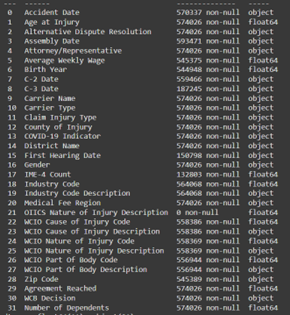
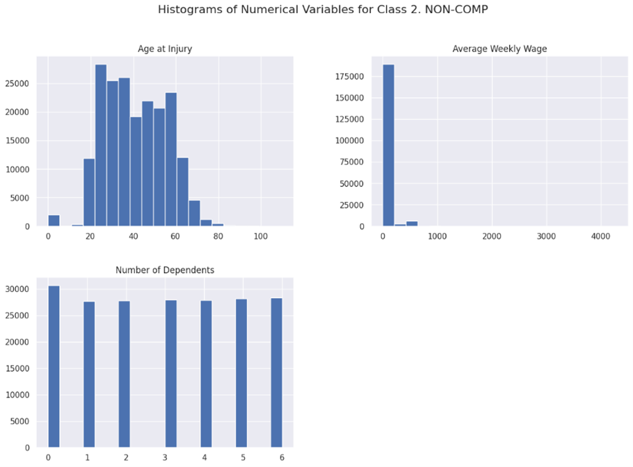
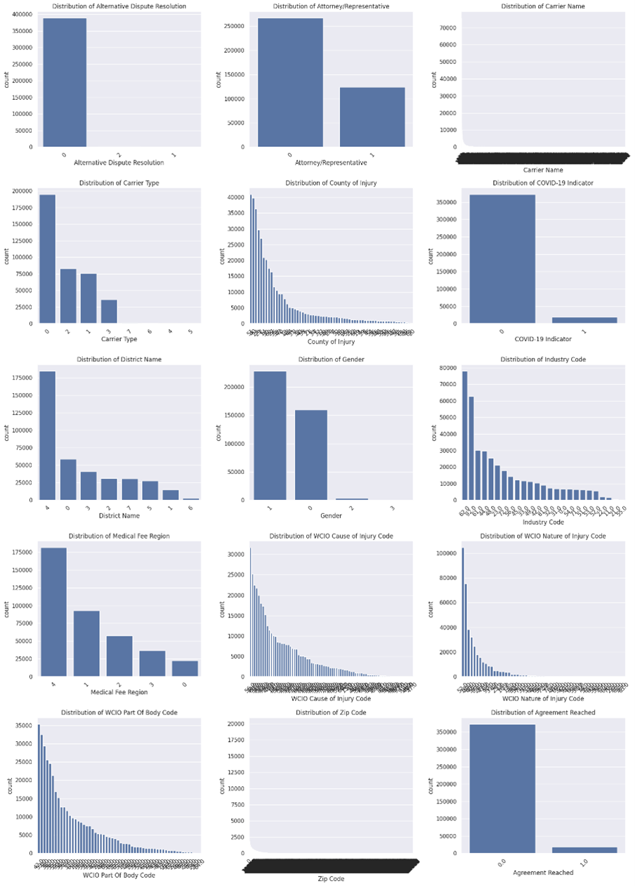
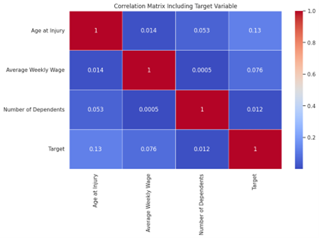
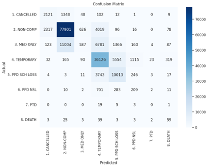
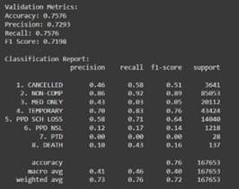
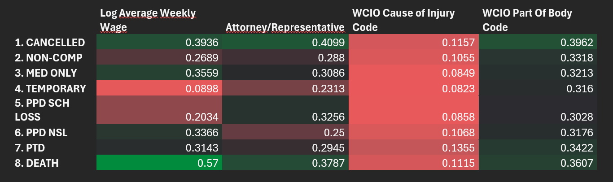
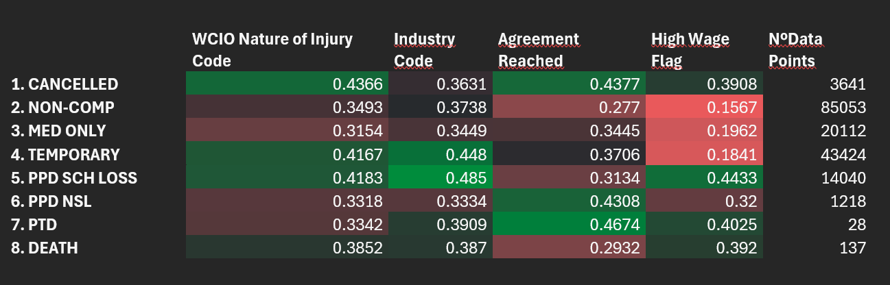

# To Grant or Not To Grant: Machine Learning Project Group 01 (2024/25)

# 1	Abstract
The goal of this project, which was created for the New York Workers' Compensation Board (WCB), was to use a large dataset to build a machine learning model that could predict and categorize the different kinds of injury claims. These classifications were formerly done by hand, which raised questions regarding bias and efficiency. This project aimed to increase accuracy, automate decision-making, and offer insights into the variables affecting each class of claims by utilizing machine learning.

With 593,471 records and 30 characteristics, the dataset needed a lot of preprocessing to deal with outliers, missing values, and inconsistencies. Imputation, feature engineering, scaling, and SMOTE balancing of the severely imbalanced dataset were important preprocessing stages. Several statistical and model-based methods were used to pick features, reducing the dataset to 12 significant features.
With an overall F1 score of 72% and very good results in predicting the majority classes, including "NON-COMP" (F1: 89%) and "TEMPORARY" (F1: 76%), a LightGBM model that was chosen by grid search optimization performed the best. Minority classes like "PTD" and "PPD NSL," however, were difficult for the model to handle, highlighting the problems with class imbalance and inadequate data representation. 

Furthermore, class-specific feature relevance was determined by SHAP analysis, providing useful information for focused model enhancements and stakeholder comprehension. Notwithstanding its drawbacks, the study demonstrates how machine learning can improve decision-making in intricate, high-volume systems. To further enhance predictions and provide stakeholders with a useful, deployable tool, future research could investigate more models, improved preprocessing, and extended data gathering techniques.
# 2	Introduction:
This group was tasked by the New York Workers’ Compensation Board, with developing a Machine Learning Model to predict and classify the type of injury of each claim made. For this, we were delivered a dataset that comprises information regarding the injury, dates and person information such as wage or number of dependents.
The WCB always performed this classification manually, but this is not efficient and can arise discrimination problems, whereas a Machine Learning problem solves both these problems. NOVA IMS was contacted to develop this project for them. 
We start this project with three main objectives:
1.	Develop a Machine Learning model capable of making an instant decision on the type of claim.
2.	Explore other models and techniques that can provide better and more accurate results.
3.	Performing a deeper analysis on the decision of each type of injury, allowing for a better model later.
# 3	Data Preparation and Preprocessing:
## 3.1	Data Exploration:
The first step of this project was to analyse the dataset. The dataset had 30 columns and 593471 rows. We utilized functions describe info and summed the NaNs to discover which problems we had to tackle later on regarding missing values, incorrect data types and which variables to drop. 
The first impressions from the dataset were a high number of missing values (Figure 1) in most variables and some variables that did not appear to add much information. I also noticed that most of the dataset’s variables were categorical (only 3 numerical variables). From describe function I understood that some of my variables had significant outliers such as Average Weekly Wage which had a maximum of almost $3 million.
The variables OIICS Nature of Injury Description, WCDecision, C-3 Date, First Hearing Date, IME-4 Count were dropped due to their high volume of missing values and the reduced information consequently. Industry Code Description, WCIO Cause of Injury Description, WCIO Nature of Injury Description, WCIO Part Of Body Description, Industry Code Description were also because all the information was already in the Code version of these variables so, by removing them we reduced complexity and redundancy.
This initial exploration was very helpful to understand how I must proceed in the next sections. What missing values should I pay more attention to or which variables had clear outliers.
## 3.2	Inconsistencies Handling:
Firstly, common errors in datasets were checked as duplicate rows and rows that are mostly empty. As such we removed 18350 duplicate rows that were mostly NaNs and did not find any duplicate indexes. Age was also inspected to see if there were incorrect age. As such, we filtered out age above 110 and age below 0 and deleted 37 rows of ages above 110. 
We also checked for inconsistencies between Birth Year, Age at Injury and Accident Date. Birth Year became Accident Date minus Age at Injury to correct any possible wrong values.
## 3.3	Dataset Split:
First, we defined X and y multiclass by assigning the target variable ‘Claim Injury Type’ as the y and the remaining columns as the X.
To split the dataset between the train and validation sets, we employed the train_test_split function to define the validation set to 30% of total rows and doing so randomly as the data did not have any order to maintain (as opposed to if it was a time series dataset. 
## 3.4	Missing Values:
The missing values were a challenging part of the preprocessing part of this project as almost all variables had missing values and there were different techniques to handle them. The Boolean variables were filled with either 0, U or Unknown. 'WCIO Cause of Injury Code', 'WCIO Nature of Injury Code', 'WCIO Part Of Body Code', 'Industry Code', 'Zip Code', 'Agreement Reached', 'Birth Year' were all filled with 0 due to their numerical values. 'Carrier Name', 'Carrier Type', 'District Name', 'County of Injury', 'Alternative Dispute Resolution', 'Attorney/Representative', 'COVID-19 Indicator' were all filled with U or Unknown. These variables cannot be imputed in other ways because due to their Boolean nature we cannot assume any value other 0/Unknow due to lack of information.
The numerical variables were handled in a different way. Average Weekly Wage was imputed the average of their Age Group, except the under 18 people which cannot have salaries, so it was imputed 0. Number of dependents was imputed with the mean as there is no connection with other variables, so it was the imputation that had least effect on the data. Age at Injury was imputed with the means to have generic values that also did not have much effect on the data.
## 3.5	Outliers Treatment:
To identify outliers of each numerical variable, I applied the IQR method. With this, I was able to identify outliers on numerical variables. In the case of age, I decided not  to treat them as I already had limited the age in the inconsistencies section. Regarding Number of Dependents there was not any outlier and Average Weekly Wage, I decided to treat it as the outliers might have an influence on the model and since the percentage of outliers was low. As such, I removed 1145 rows, which amount to a very small percentage of the dataset (under 1%).
## 3.6	Feature Engineering:
To retrieve more value from the variables, I decided to create new values that either combined variables to create more informative ones or utilized flags to signal out of normal events. I created two flag variables. I wanted to flag unusually large values in Number of Dependents and Average Weekly Wage as these could bring more value than only having the original variable. Then I created a log of the variables to smooth the effects of values very distant from the normal values. Finally, I related the Number of Dependents with the Average Weekly Salary by creating the Wage per Dependent variable that adds information to two already very informative variables.
## 3.7	Data Scaling
A necessary Preprocessing step is Scaling. This step ensures that all numerical variables regardless of their scales or units have similar impact on the model, avoiding giving more weight to higher values variables. We decided to use Robust Scaler to achieve this, as this scaling method preserves data distribution and is less sensitive to outliers compared to Min-Max Scaler. 
## 3.8	Final Exploration
After performing all Preprocessing steps, it is important to perform a final exploration on the final dataset that I am going to use for the model. With this exploration it is crucial to understand if there are any gaps in the preprocessing such as missing values that remained and it is particularly important to understand if the new features created have more value or if they are redundant. Additionally, due to the imputation techniques applied to the numerical features it is important to understand if the distribution makes sense. 
I used bar graphs and boxplots to see the distributions of numerical and Boolean variables in general and grouping them by each class of the target variable to understand major differences in each variable. I also plotted correlation matrices to understand if there were any redundant variables (Figure 4). Since the highest value was around 0.15 this means that there were no variables that had redundancy and, as such, was not needed any further treatment and we could move on to the Feature Selection (Figures 2 and 3).
## 3.9	Test Dataset Treatment
Before I could move on to Model Training and Predictions, it was crucial to preprocess the test data to match the format of the training and validation sets. Since, the test data should be as little altered as possible, I only performed the necessary transformations so I could apply the model. I removed the missing values, created the same features as I did for the training and validation sets and I selected the same final features. 
# 4	Model Training and Predicting
## 4.1	Feature Selection:
To reduce the complexity of the dataset, it was crucial to do Feature Selection. For this I implemented a combination of 4 different methods that rank the features and outputted the topmost important features:
Variance Threshold – The features outputted were: 'Age at Injury', 'Attorney/Representative', 'Average Weekly Wage', 'Birth Year', 'Carrier Name', 'Carrier Type', 'County of Injury', 'District Name', 'Gender', 'Industry Code', 'Medical Fee Region', 'WCIO Cause of Injury Code', 'WCIO Nature of Injury Code', 'WCIO Part Of Body Code', 'Zip Code', 'Number of Dependents', 'Age Group', 'Wage per Dependent', 'Log Average Weekly Wage', 'Log Number of Dependents', 'Large Family Flag']
ANOVA – The features outputted were: 'Log Average Weekly Wage', 'Attorney/Representative', 'High Wage Flag', 'Agreement Reached', 'Industry Code', 'Birth Year', 'WCIO Nature of Injury Code', 'WCIO Part Of Body Code', 'WCIO Cause of Injury Code', 'Age at Injury'.
Feature Importance (Random Forest) – The features outputted were: ‘Log Average Weekly Wage’, ‘Average Weekly Wage’, ‘Wage per Dependent’, ‘Attorney/Representative’, ‘Zip Code’, ‘WCIO Part Of Body Code’, ‘WCIO Cause of Injury Code’, ‘Birth Year’, ‘Carrier Name’, ‘Age at Injury’.
Mutual Info Classification – The features outputted were: 'Log Average Weekly Wage', 'Average Weekly Wage', 'Wage per Dependent', 'Attorney/Representative', 'WCIO Nature of Injury Code', 'WCIO Part Of Body Code', 'WCIO Cause of Injury Code', 'High Wage Flag', 'Carrier Name', 'Agreement Reached'
After performing these methods, I created a table with how many times each Feature had been selected in all these methods. I then chose all features that were chosen at least 2 times (all variables had been selected at least 1 time). This created a final dataset of 12 features: 'Log Average Weekly Wage', 'Attorney/Representative', 'WCIO Cause of Injury Code', 'WCIO Part Of Body Code', 'WCIO Nature of Injury Code', 'Industry Code', 'Agreement Reached', 'High Wage Flag', 'Birth Year', 'Age at Injury', 'Average Weekly Wage', 'Wage per Dependent', 'Carrier Name'.
## 4.2	Class Imbalance
Class imbalance is a serious concern in predictive modelling due to the probability of the model over-classifying the majority class if left untreated. I used SMOTE to balance the classes, aiming to maintain the proportionality of the classes (instead of applying the same percentage of the majority class to all classes). SMOTE oversamples by applying new data points in the neighborhood of real data points instead of inserting random data points. This ensures
## 4.3	Initial Models Chosen and Grid-Search
For this section, I trained three different models: Light GBM, Logistic Regression and Decision Trees. Due to time constraints, my main selection criteria was the most efficient models. To tune the hyperparameters, I used Grid Search with 3 CV folds and 3 or 4 parameters for each model. 
I created a Grid Search function that set the initial parameters to default and searched for the best combination of parameters in each model. After that it returned a score from each model with the best combination of parameters and the highest score was the best model.
## 4.4	Final Model Selected
After performing Grid Search, the best model was Light GBM with a score of 0.79. I retrained the model separately, to avoid having to run Grid-Search every time I ran the code, storing the Grid Search results.
After training the model we predicted both in the validation and test sets. Since we only had the correct values for the validation set, I analyzed those results using a confusion matrix and a classification report.
The classification report shows the precision, recall and f1 score of each class, the macro and the weighted values (general) and the confusion matrix. Since our main metric for measuring the quality of our model was the f1-score, the classification report (Table 1) offers a very clear picture of our results. The confusion matrix allows us to analyze, not only which classes were predicted better or worse, but also if they are inaccurate where were the predictions. This allows for further analysis and better understanding (Figure 5 and 6).
## 4.5	Results and Discussion
The model's performance was evaluated using F1 score, precision, and recall as the main metrics. These metrics were analyzed in detail across all classes, with a particular focus on larger and smaller classes in the dataset, to better understand the model's strengths and limitations.
For the larger classes, particularly "NON-COMP," which constitutes most of the dataset, the model performed exceptionally well. With a precision of 86%, a recall of 92%, and an F1 score of 89%, the model demonstrated its ability to identify these cases with high accuracy while minimizing false positives. This strong performance is indicative of the model's capacity to generalize effectively for well-represented classes, likely due to the abundance of training examples.
Similarly, the class "TEMPORARY," another large class, also yielded satisfactory results. The model achieved a recall of 83%, which shows its capability to identify a significant proportion of true positives. Its F1 score of 76% and precision of 70% indicate a balanced performance, suggesting that the model can handle this class effectively while maintaining a reasonable trade-off between false positives and false negatives.
In contrast, the smaller classes presented considerable challenges for the model. For instance, the "PPD NSL" class, which represents a minimal proportion of the dataset, displayed poor performance with a precision of 12%, a recall of 17%, and an F1 score of 14%. These metrics reveal the model's difficulty in accurately predicting cases from this class, likely due to the severe class imbalance that resulted in insufficient examples for effective learning.
The "PTD" class represents the most extreme case of imbalance, with only 28 samples in the dataset. The model failed to make any correct predictions for this class, resulting in zero precision, recall, and F1 score. This highlights the inherent limitation of the current training approach in handling such highly underrepresented classes, as the model struggles to differentiate between this class and others.
The "MED ONLY" class, while not as small as "PTD" or "PPD NSL," also exhibited weak performance. Despite a moderate precision of 43%, the recall was strikingly low at only 3%, leading to a very low F1 score of 5%. This suggests that while the model occasionally predicts this class, it misses most true instances, rendering its utility for this class ineffective.
A notable observation is the discrepancy in performance metrics across classes of varying sizes. While larger classes such as "NON-COMP" and "TEMPORARY" benefited from sufficient representation, smaller classes like "PPD NSL," "PTD," and "MED ONLY" suffered from the lack of training examples. This imbalance is further reflected in the macro average scores, which weigh each class equally and thus highlight the variability in performance across classes. The macro F1 score of 40% underscores the significant challenges faced in predicting the minority classes, despite the overall weighted average F1 score of 72% reflecting satisfactory performance for the majority classes.
# 5	Open-Ended Section
## 5.1	Analysis of Feature Importance for each class
After performing the predictions in our model, it is interesting to understand what features are more important for every class. This analysis is very interesting to help us gain many insights:
•	By identifying features that are more important for specific classes can help us understand how to improve the model prediction in specific classes that might be more important.
•	By identifying features that consistently were less important than others, we can identify points of improvements by not selecting them or feature engineering them.
•	If stakeholders have a class that is crucial to have good predictions, we can use this information to improve the features with the highest feature importance and mold the features in the model to the ones that are more important to that specific class.
To extract the feature importance from each class I used a library called SHAP. From this library I used the tree explorer that computes the SHAP value for each feature and then I iterated this process by each class of the target.
In the "MED ONLY" class, "WCIO Nature of Injury Code" (0.3154) is again the most important feature, but there is reduced reliance on "WCIO Cause of Injury Code" (0.0849). This indicates that while the nature of injuries is crucial, the specific causes are less relevant in medical-only claims. Similarly, for "TEMPORARY" cases, "Industry Code" (0.448) emerges as the leading feature, reflecting workplace-specific factors, whereas "Log Average Weekly Wage" (0.0898) plays a negligible role.
For more severe cases, such as "PPD SCH LOSS," "Industry Code" (0.485) and "High Wage Flag" (0.4433) are key predictors, while injury causation is less impactful. Similarly, "PPD NSL" and "PTD" cases are heavily influenced by "Agreement Reached" (0.4308 and 0.4674, respectively), underscoring the legal or settlement context in these classifications.
The analysis also highlights potential issues with class imbalance. Minority classes, such as "PTD" (28 cases) and "DEATH" (137 cases), display more variability in feature importance due to limited data points, suggesting that predictions for these classes may be more sensitive to outliers.
# 6	Conclusions
At the start of this project, I set out to develop a predictive model that was able to accurately predict decisions regarding claims for the New York Workers’ Compensation Board. I was also tasked with implementing strategies to improve model performance and finally providing an additional analysis of the importance of different features in each class prediction. After doing the Data Preparation, Data Preprocessing, Feature and Model Selection and Predictions we can make some conclusions about the work, our predictions and how the work can be improved later.
Overall, the model has no difficulty predicting the majority class, as expected, but has much difficulty predicting the lower classes. This was not surprising as that was already expected due to the high-class imbalance in the dataset. We can understand that this model is very strong at identifying the majority classes (NON-COMP and TEMPORARY) but was unable to predict the minority class (PTD). This can be linked to mistakes made in the preprocessing steps and proper research of some features. Additionally, it can also be attributed to the use of few different models and the lack of datapoints in the minority classes.
Throughout the project there were some points, some surprising and some predictable, that are of note and relevant to the results. In the feature selection section, it was not surprising that most new features such as logs or flags were more relevant than the original variables as they are more informative. Regarding the models, it was surprising that the light version of Neural Networks had a lower score than Light GBM. As it is more computationally more expensive, I would assume it would provide better results, unlike the Decision Trees that are less computationally expensive and as predicted provided worse results.
Regarding the analysis of the feature importance for each class, it provided interesting insights and can become a point of more targeted model improvement. This approach can help us, together with the stakeholders, to identify which class is more important to accurately predict. It can also help identify features that may require further preprocessing or feature engineering.
## 6.1	Limitations and Future Work
The limitations of this work were mostly connected to lack of time (mostly due to the computation time of many models). The main aspect of this work, it would be relevant to have worked on was trying more models, such as KNN, SVM or Random Forest with proper Grid-Search as this can be critical to achieving good results. It would also have been interesting to analyze properly each variable, particularly the ones more sector specific such as the codes. This would have generated the possibility of creating more informative variables, which would have helped the model perform better. Further analysis and plots would also have given me a better understanding of the relationship between each variable and the target.
Regarding the open section, it would also have been very interesting to develop an app for stakeholders to be able to take full advantage of the model later. This would have an excellent way for them to take full advantage of this project and it would have been usable for technical and non-technical audiences.
After finishing this project and analyzing the suboptimal results as mentioned above, I recognize potential for improvement. I suggest the New York Workers’ Compensation Board develop protocols for further data collection so we can establish a better training base and continuously retrain the model and improve results. It is also highly recommended to maintain the continuous monitoring of the model.
# 7	References:
•	https://imbalanced-learn.org/stable/references/generated/imblearn.over_sampling.SMOTE.html
•	https://scikit-learn.org/1.5/modules/generated/sklearn.model_selection.GridSearchCV.html
•	https://lightgbm.readthedocs.io/en/stable/
•	https://scikit-learn.org/1.5/modules/neural_networks_supervised.html
# 8	Appendix:
Important Concepts:
1.	SMOTE – SMOTE stands for Synthetic Minority Oversampling Technique and it is a technique used to handle class imbalance in a dataset. It is useful when minority class is underrepresented. Unlike other oversampling techniques instead of creating duplicate points, it creates synthetic points. This is a useful technique to avoid overfitting.
2.	Grid_Search – It is a technique used to find the optimal combination of parameters for a model (inside the scope provided by the user). This iteratively trains with every combination of parameters to find the optimal. This can be very time consuming and computationally expensive.
3.	Light GBM – Light Gradient Boosting Machine is a light and fast framework for gradient boosting. It builds an ensemble of decision trees sequentially where each tree tries to minimize the error of the prior.
4.	MLP - The Multilayer Perceptron (MLP) is a fundamental neural network architecture used for both classification and regression tasks. It consists of an input layer for features, one or more hidden layers with neurons applying activation functions (such as ReLU or sigmoid) to capture non-linear patterns, and an output layer that produces predictions. While they are powerful for modeling complex relationships, they can overfit without proper regularization and are sensitive to hyperparameter tuning. They are more effective in small and medium datasets.
5.	SHAP - SHapley Additive exPlanations is a library used to interpret ML models to extract the feature importance for each class.

## Figures and Tables

